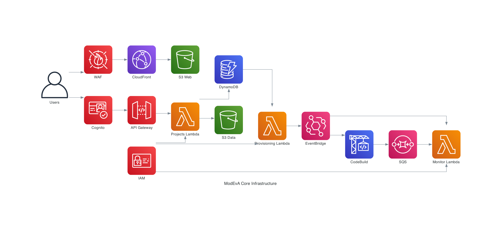
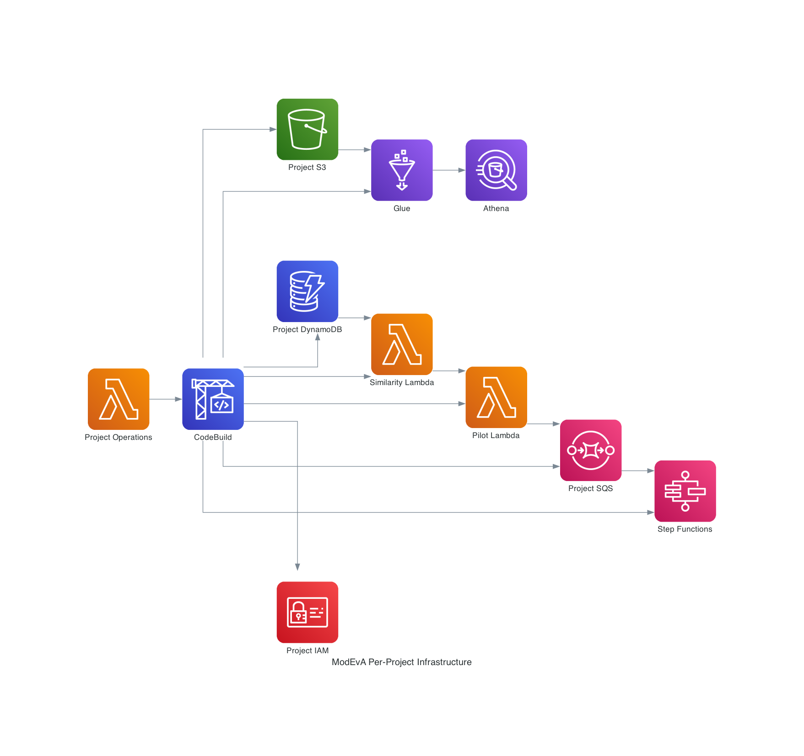

# Guidance for Intelligent Application Modernization Explorer on AWS

## Table of Contents

1. [Overview](#overview)
    - [Cost](#cost)
2. [Prerequisites](#prerequisites)
    - [Operating System](#operating-system)
3. [Deployment Steps](#deployment-steps)
4. [Deployment Validation](#deployment-validation)
5. [Running the Guidance](#running-the-guidance)
6. [Next Steps](#next-steps)
7. [Cleanup](#cleanup)
8. [FAQ, known issues, additional considerations, and limitations](#faq-known-issues-additional-considerations-and-limitations)
9. [Revisions](#revisions)
10. [Notices](#notices)
11. [Authors](#authors)

## Overview

App-ModEx (Intelligent Applications Modernization Explorer) is a comprehensive serverless solution for assessing, planning, and executing application modernization initiatives. This Guidance helps organizations understand their current state, identify modernization opportunities through AI-enhanced analysis, plan their initiatives with cost and resource estimates, and track implementation progress.

### Why was this Guidance built?

Organizations face significant challenges when modernizing their application portfolios:
- Difficulty identifying which applications to modernize first
- Lack of visibility into team skills and capability gaps
- Uncertainty about modernization costs and resource requirements
- No systematic approach to group similar applications for efficient migration
- Limited ability to leverage patterns and reuse across modernization efforts

### What problem does this Guidance solve?

This Guidance provides a data-driven, AI-enhanced framework for application modernization that:
- **Assesses current state** through comprehensive data collection (skills, applications, technology stack, infrastructure)
- **Generates insights** using AI-powered analysis including skill gap identification and technology stack assessment
- **Identifies pilot candidates** using a revolutionary three-stage approach (rule-based, AI-enhanced, and consolidated scoring)
- **Plans modernization** with application grouping, TCO estimation, and team resource allocation
- **Tracks execution** through process monitoring and data processing dashboards

### Architecture Overview

The solution uses a two-part deployment architecture that separates core infrastructure from per-project resources:

#### Core Infrastructure Architecture


#### Per-Project Infrastructure Architecture  


### Architecture Flow

**Core Infrastructure (6 CDK Stacks - One-time Deployment):**

1. **AppModEx-Application** - AWS AppRegistry and resource groups for organization
2. **AppModEx-PromptTemplates** - DynamoDB table for AI prompt management with versioning
3. **AppModEx-Data** - DynamoDB tables, Cognito User Pool, S3 buckets, Glue databases
4. **AppModEx-Backend** - 30+ Lambda functions (Node.js 22.x), SQS queues, Step Functions
5. **AppModEx-Api** - API Gateway with Cognito authorizers and 55+ endpoints
6. **AppModEx-Frontend** - S3 static hosting, CloudFront distribution, AWS WAF protection

**Per-Project Infrastructure (Automatic Provisioning via CodeBuild):**

When users create projects through the UI, the system automatically provisions:
- Project-specific S3 buckets for data and Athena results
- DynamoDB tables for project data
- Glue databases and tables for analytics
- 5 Step Functions workflows (Application Similarity, Component Similarity, Pilot Identification, Skill Importance, Export Generation)
- Lambda functions for data processing and AI analysis
- IAM roles with project-specific permissions

**Event-Driven Architecture:**
```
Project Creation → DynamoDB Streams → Provisioning Lambda → CodeBuild → EventBridge → Build Monitor Lambda → Status Update
```

**AI Integration:**
- Amazon Bedrock (Claude 3.7 Sonnet) for pilot identification and contextual analysis
- Amazon Bedrock (Nova Lite) for technology normalization and skill importance scoring
- Direct model invocation via BedrockRuntimeClient for cost optimization
- Prompt templates stored in DynamoDB with 1-hour caching

### Cost

_You are responsible for the cost of the AWS services used while running this Guidance. As of April 2026, the cost for running this Guidance with the default settings in the US East (N. Virginia) region is approximately $14 per month (or as low as $9/month during the first year with AWS Free Tier) for a small deployment with 5 active users, 1 project, and 100 applications. Costs scale with usage - a larger deployment with 50 users, 10 projects, and 5,000 applications costs approximately $360 per month._

_We recommend creating a [Budget](https://docs.aws.amazon.com/cost-management/latest/userguide/budgets-managing-costs.html) through [AWS Cost Explorer](https://aws.amazon.com/aws-cost-management/aws-cost-explorer/) to help manage costs. Prices are subject to change. For full details, refer to the pricing webpage for each AWS service used in this Guidance._

### Sample Cost Table

**Note:** The following table provides a sample cost breakdown for deploying this Guidance with the default parameters in the US East (N. Virginia) Region for one month. Costs are shown for a small deployment scenario: 5 active users, 1 project, 100 applications with 400 components.

| AWS service  | Dimensions | Cost (First Year) [USD] | Cost (Ongoing) [USD] |
| ----------- | ------------ | ------------ | ------------ |
| Amazon S3 | 10 GB storage, 50,000 GET requests, 5,000 PUT requests | $0.15 | $0.30 |
| Amazon CloudFront | 50 GB data transfer out, 250,000 HTTP/HTTPS requests | $0.00 | $5.00 |
| Amazon API Gateway | 15,000 REST API calls per month | $0.02 | $0.02 |
| AWS Lambda | 50,000 invocations, 200 GB-seconds compute (within free tier) | $0.00 | $0.00 |
| Amazon DynamoDB | 2 GB storage, 15,000 read units, 3,000 write units (on-demand) | $0.51 | $0.51 |
| Amazon Cognito | 5 monthly active users (within free tier of 50,000 MAU) | $0.00 | $0.00 |
| Amazon Bedrock | Claude 3.7 Sonnet: 200K input/40K output tokens; Nova Lite: 70K input/15K output tokens | $1.21 | $1.21 |
| AWS Step Functions | 148 state transitions (within free tier of 4,000/month) | $0.00 | $0.00 |
| Amazon Athena | 5 GB data scanned per month | $0.03 | $0.03 |
| AWS Glue | Data Catalog: 1 database, 50 tables stored | $0.50 | $0.50 |
| Amazon CloudWatch | 5 GB logs ingestion, 10 custom metrics, 5 alarms (within free tier) | $0.00 | $0.00 |
| AWS CodeBuild | 20 build minutes for project provisioning (within free tier of 100 min/month) | $0.00 | $0.00 |
| AWS WAF | 1 Web ACL, 5 rules, 10M requests | $6.00 | $6.00 |
| Amazon EventBridge | 10,000 custom events | $0.01 | $0.01 |
| AWS Secrets Manager | 1 secret with 1,000 API calls | $0.45 | $0.45 |
| Amazon SQS | 100,000 requests (within free tier of 1M/month) | $0.00 | $0.00 |
| **Total estimated cost** | **Small deployment (5 users, 1 project, 100 applications)** | **$8.88/month** | **$14.03/month** |

**Cost Optimization Notes:**
- **AWS Free Tier Benefits:** During your first 12 months, S3 and CloudFront free tiers reduce costs to approximately $9/month. After the first year, ongoing costs are approximately $14/month for small deployments.
- **Always-Free Services:** Lambda (1M requests/month), Cognito (50K MAU), Step Functions (4K transitions/month), CloudWatch (10 metrics, 10 alarms, 5GB logs), CodeBuild (100 minutes/month), and SQS (1M requests/month) remain free indefinitely within their generous limits.
- **Cognito:** FREE for first 50,000 monthly active users
- **Lambda:** FREE tier includes 1M requests and 400,000 GB-seconds per month
- **DynamoDB:** On-demand billing optimizes costs for variable workloads
- **Bedrock:** Nova Lite is 50x cheaper than Claude for simple tasks (normalization, skill scoring)
- **Step Functions:** Costs scale with actual usage (per state transition)
- **Cost Scaling:** Larger deployments (50 users, 10 projects, 5,000 applications) cost approximately $360/month, with primary cost drivers being DynamoDB ($150), CloudFront ($95), and Bedrock ($12)

## Prerequisites

### Operating System

These deployment instructions are optimized to best work on **Amazon Linux 2023 AMI**, **macOS**, or **Linux distributions**. Deployment on Windows may require additional steps (use WSL2 for best compatibility).

**Required Software:**
- **Node.js** v22 or later (to match Lambda runtime)
- **npm** v9 or later (comes with Node.js)
- **AWS CLI** v2.x configured with appropriate credentials
- **AWS CDK CLI** v2.x - Install globally: `npm install -g aws-cdk`
- **Git** for cloning the repository

**Installation Commands (Amazon Linux 2023):**
```bash
# Install Node.js 22.x
curl -fsSL https://rpm.nodesource.com/setup_22.x | sudo bash -
sudo yum install -y nodejs

# Install AWS CLI v2
curl "https://awscli.amazonaws.com/awscli-exe-linux-x86_64.zip" -o "awscliv2.zip"
unzip awscliv2.zip
sudo ./aws/install

# Install AWS CDK CLI
sudo npm install -g aws-cdk

# Verify installations
node --version
npm --version
aws --version
cdk --version
```

**Installation Commands (macOS):**
```bash
# Using Homebrew
brew install node
brew install awscli
npm install -g aws-cdk
```

### Third-party tools

No additional third-party tools are required beyond the standard AWS SDK and CDK dependencies listed in `package.json`.

### AWS account requirements

**Required AWS Account Setup:**

1. **AWS Account** with administrative permissions or sufficient IAM permissions to create:
   - IAM roles and policies
   - Lambda functions
   - API Gateway REST APIs
   - DynamoDB tables
   - S3 buckets
   - CloudFront distributions
   - Cognito User Pools
   - Step Functions state machines
   - Glue databases and tables
   - CodeBuild projects
   - EventBridge rules

2. **Amazon Bedrock Model Access** - Enable access to:
   - Anthropic Claude 3.7 Sonnet (for pilot identification and contextual analysis)
   - Amazon Nova Lite (for technology normalization and skill importance scoring)
   - Navigate to Amazon Bedrock console → Model access → Request access for required models

3. **AWS Region Enablement** - Ensure your target region is enabled in your AWS account

4. **Service Quotas** - Verify sufficient quotas for:
   - Lambda concurrent executions (recommended: at least 100)
   - API Gateway requests per second (recommended: at least 1000)
   - DynamoDB tables per region (recommended: at least 50)
   - S3 buckets per account (recommended: at least 20)

**Optional but Recommended:**
- **ACM Certificate** - For custom domain configuration (must be in us-east-1 for CloudFront)
- **Route 53 Hosted Zone** - For custom domain DNS management

### aws cdk bootstrap

This Guidance uses AWS CDK for infrastructure deployment. If you are using AWS CDK for the first time in your AWS account and region, you must bootstrap your environment:

```bash
# Configure AWS credentials
aws configure --profile app-modex-prod

# Bootstrap CDK (replace with your account ID and region)
cdk bootstrap aws://ACCOUNT-ID/us-east-1 --profile app-modex-prod
cdk bootstrap aws://ACCOUNT-ID/us-west-2 --profile app-modex-prod

# Verify bootstrap
aws cloudformation describe-stacks --stack-name CDKToolkit --profile app-modex-prod
```

**Note:** Bootstrap is required in both:
- Your backend deployment region (e.g., us-west-2)
- us-east-1 (required for CloudFront and WAF resources)

### Service limits

**Critical Service Limits:**

1. **Amazon Bedrock Throttling:**
   - Claude 3.7 Sonnet: Default 10 requests per minute
   - Nova Lite: Default 100 requests per minute
   - The Guidance implements conservative throttling to stay within limits
   - For high-volume usage, request quota increases via AWS Service Quotas console

2. **AWS Lambda:**
   - Concurrent executions: Default 1000 per region
   - May need increase for large-scale deployments
   - [Request increase](https://console.aws.amazon.com/servicequotas/home/services/lambda/quotas)

3. **Amazon API Gateway:**
   - Steady-state requests per second: Default 10,000
   - Burst capacity: Default 5,000
   - [Request increase](https://console.aws.amazon.com/servicequotas/home/services/apigateway/quotas)

### Supported Regions

**Backend Infrastructure:** Can be deployed to any AWS region that supports all required services (Lambda, DynamoDB, API Gateway, Step Functions, Bedrock, etc.)

**Frontend Infrastructure:** Must be deployed to **us-east-1** for AWS WAF protection with CloudFront.

**Recommended Regions:**
- us-east-1 (N. Virginia) - Full feature support including WAF
- us-west-2 (Oregon) - Full feature support
- eu-west-1 (Ireland) - Full feature support
- eu-west-2 (London) - Full feature support

**Note:** Verify Amazon Bedrock model availability in your chosen region. Claude 3.7 Sonnet and Nova Lite must be available.

## Deployment Steps

### Step 1: Clone the Repository

```bash
git clone https://github.com/aws-solutions-library-samples/guidance-for-intelligent-application-modernization-explorer.git
cd app-modex-project
```

### Step 2: Install Infrastructure Dependencies

```bash
cd infrastructure
npm install
```

### Step 3: Configure Environment Variables

Create a configuration file or set environment variables for your deployment:

```bash
# Set your AWS profile
export AWS_PROFILE=app-modex-prod

# Set your target region for backend
export AWS_REGION=us-west-2

# Set environment name (dev, staging, prod)
export ENVIRONMENT=prod
```

### Step 4: Bootstrap CDK (First-time Only)

If you haven't bootstrapped CDK in your account and regions:

```bash
# Bootstrap backend region
cdk bootstrap aws://ACCOUNT-ID/us-west-2 --profile app-modex-prod

# Bootstrap frontend region (required for CloudFront/WAF)
cdk bootstrap aws://ACCOUNT-ID/us-east-1 --profile app-modex-prod
```

### Step 5: Deploy Core Infrastructure (All 6 Stacks)

**Option A: Deploy All Stacks at Once (Recommended)**

```bash
# Deploy all 6 stacks in correct dependency order
./scripts/deploy.sh --profile app-modex-prod --region us-west-2
```

**Option B: Deploy Stacks Individually**

```bash
# Deploy in this specific order (dependencies matter)
./scripts/deploy-application-stack.sh --profile app-modex-prod --region us-west-2
./scripts/deploy-prompt-templates-stack.sh --profile app-modex-prod --region us-west-2
./scripts/deploy-data-stack.sh --profile app-modex-prod --region us-west-2
./scripts/deploy-backend-stack.sh --profile app-modex-prod --region us-west-2
./scripts/deploy-api-stack.sh --profile app-modex-prod --region us-west-2
./scripts/deploy-frontend-stack.sh --profile app-modex-prod
```

**Note:** The frontend stack is always deployed to us-east-1 regardless of the backend region.

### Step 6: Capture Deployment Outputs

After successful deployment, capture the following outputs:

```bash
# Get API Gateway URL
aws cloudformation describe-stacks \
  --stack-name AppModEx-Api \
  --query 'Stacks[0].Outputs[?OutputKey==`ApiUrl`].OutputValue' \
  --output text \
  --profile app-modex-prod \
  --region us-west-2

# Get Cognito User Pool ID
aws cloudformation describe-stacks \
  --stack-name AppModEx-Data \
  --query 'Stacks[0].Outputs[?OutputKey==`UserPoolId`].OutputValue' \
  --output text \
  --profile app-modex-prod \
  --region us-west-2

# Get Cognito User Pool Client ID
aws cloudformation describe-stacks \
  --stack-name AppModEx-Data \
  --query 'Stacks[0].Outputs[?OutputKey==`UserPoolClientId`].OutputValue' \
  --output text \
  --profile app-modex-prod \
  --region us-west-2

# Get CloudFront Distribution URL
aws cloudformation describe-stacks \
  --stack-name AppModEx-Frontend \
  --query 'Stacks[0].Outputs[?OutputKey==`DistributionUrl`].OutputValue' \
  --output text \
  --profile app-modex-prod \
  --region us-east-1
```

### Step 7: Configure Frontend Environment

Navigate to the frontend directory and create environment configuration:

```bash
cd ../app-modex-ui
cp .env.example .env
```

Edit the `.env` file with your deployment outputs:

```bash
# Core Configuration
REACT_APP_API_URL=https://YOUR-API-ID.execute-api.us-west-2.amazonaws.com/prod
REACT_APP_AWS_REGION=us-west-2

# Authentication (from Step 6 outputs)
REACT_APP_USER_POOL_ID=us-west-2_XXXXXXXXX
REACT_APP_USER_POOL_CLIENT_ID=XXXXXXXXXXXXXXXXXXXXXXXXXX
REACT_APP_IDENTITY_POOL_ID=us-west-2:XXXXXXXX-XXXX-XXXX-XXXX-XXXXXXXXXXXX

# Storage
REACT_APP_S3_BUCKET=app-modex-data-ACCOUNT-ID

# Feature Flags
REACT_APP_AUTH_REQUIRED=true
REACT_APP_DEBUG_MODE=false
```

### Step 8: Build and Deploy Frontend

```bash
# Install frontend dependencies
npm install

# Build the React application
npm run build

# The build artifacts are automatically deployed to S3 by the CDK stack
# If you need to manually sync:
aws s3 sync build/ s3://app-modex-frontend-ACCOUNT-ID/ --profile app-modex-prod

# Invalidate CloudFront cache
aws cloudfront create-invalidation \
  --distribution-id YOUR-DISTRIBUTION-ID \
  --paths "/*" \
  --profile app-modex-prod
```

### Step 9: Create Initial Cognito User

```bash
# Create an admin user
aws cognito-idp admin-create-user \
  --user-pool-id us-west-2_XXXXXXXXX \
  --username admin@example.com \
  --user-attributes Name=email,Value=admin@example.com Name=email_verified,Value=true \
  --temporary-password TempPassword123! \
  --profile app-modex-prod \
  --region us-west-2

# User will be prompted to change password on first login
```

## Deployment Validation

### Validate CloudFormation Stacks

1. Open the AWS CloudFormation console in your deployment region
2. Verify all 6 stacks show **CREATE_COMPLETE** status:
   - `AppModEx-Application`
   - `AppModEx-PromptTemplates`
   - `AppModEx-Data`
   - `AppModEx-Backend`
   - `AppModEx-Api`
3. Open CloudFormation console in us-east-1 region
4. Verify the frontend stack shows **CREATE_COMPLETE** status:
   - `AppModEx-Frontend`

**CLI Validation:**
```bash
# Check backend stacks
aws cloudformation describe-stacks \
  --query 'Stacks[?starts_with(StackName, `AppModEx`)].{Name:StackName,Status:StackStatus}' \
  --output table \
  --profile app-modex-prod \
  --region us-west-2

# Check frontend stack
aws cloudformation describe-stacks \
  --stack-name AppModEx-Frontend \
  --query 'Stacks[0].StackStatus' \
  --output text \
  --profile app-modex-prod \
  --region us-east-1
```

### Validate Lambda Functions

Verify Lambda functions are created with Node.js 22.x runtime:

```bash
aws lambda list-functions \
  --query 'Functions[?starts_with(FunctionName, `app-modex`)].{Name:FunctionName,Runtime:Runtime}' \
  --output table \
  --profile app-modex-prod \
  --region us-west-2
```

Expected output should show 30+ Lambda functions with `nodejs22.x` runtime.

### Validate API Gateway

```bash
# Get API Gateway ID
aws apigateway get-rest-apis \
  --query 'items[?name==`AppModEx-Api`].{Name:name,Id:id}' \
  --output table \
  --profile app-modex-prod \
  --region us-west-2

# Test API health endpoint (if available)
curl -X GET https://YOUR-API-ID.execute-api.us-west-2.amazonaws.com/prod/health
```

### Validate DynamoDB Tables

```bash
aws dynamodb list-tables \
  --query 'TableNames[?starts_with(@, `app-modex`)]' \
  --output table \
  --profile app-modex-prod \
  --region us-west-2
```

Expected tables include:
- `app-modex-projects`
- `app-modex-project-data`
- `app-modex-project-sharing`
- `app-modex-process-tracking`
- `app-modex-prompt-templates`
- Additional project-specific tables (created when projects are created)

### Validate CloudFront Distribution

```bash
aws cloudfront list-distributions \
  --query 'DistributionList.Items[?Comment==`AppModEx Frontend Distribution`].{Id:Id,Status:Status,DomainName:DomainName}' \
  --output table \
  --profile app-modex-prod
```

Status should show **Deployed**.

### Validate Frontend Access

1. Open your browser and navigate to the CloudFront distribution URL
2. You should see the App-ModEx login page
3. Attempt to log in with the Cognito user created in Step 9
4. You should be prompted to change your temporary password
5. After password change, you should see the projects list page

**Expected Result:** Successfully logged in and viewing the App-ModEx dashboard.

## Running the Guidance

### Initial Setup and First Project

1. **Access the Application**
   - Navigate to your CloudFront distribution URL: `https://YOUR-DISTRIBUTION-ID.cloudfront.net`
   - Or use your custom domain if configured: `https://app-modex.yourcompany.com`

2. **Log In**
   - Enter your Cognito username and temporary password
   - Change password when prompted
   - You'll be redirected to the Projects List page

3. **Create Your First Project**
   - Click **Create Project** button
   - Enter project name: `Modernization Initiative 2026`
   - Add description: `Initial assessment of application portfolio`
   - Click **Create**
   - Wait 5-10 minutes for automatic provisioning (CodeBuild creates project-specific infrastructure)
   - Refresh the page to see status change from "Provisioning" to "Active"

4. **Upload Sample Data**
   
   The Guidance includes sample CSV files in the `SAMPLE_DATA/` directory:
   
   > **Note:** All sample data files are entirely synthetic, generated using generative AI through agent-powered sessions (Kiro CLI) for demonstration and testing purposes only. They do not contain any real customer, employee, or organizational data.
   
   ```bash
   # Sample data files provided:
   SAMPLE_DATA/1_skills_inventory.csv
   SAMPLE_DATA/2_technology_radar.csv
   SAMPLE_DATA/3_application_inventory.csv
   SAMPLE_DATA/4_technology_components.csv
   SAMPLE_DATA/5_infrastructure_resources.csv
   SAMPLE_DATA/6_resource_utilization.csv
   ```

   **Upload Process:**
   - Navigate to **Data → Skills Inventory**
   - Scroll to **Data Sources** section
   - Click **Upload File**
   - Select `1_skills_inventory.csv`
   - Review preview and click **Upload**
   - Repeat for other data files in their respective sections

5. **Monitor Data Processing**
   - Navigate to **Process Dashboard** from the sidebar
   - View processing status for each uploaded file
   - Wait for all processes to show "Completed" status
   - Check for any errors and resolve if needed

### Running Pilot Identification Analysis

**Input:** Application portfolio data, technology stack data, team skills data

**Steps:**

1. Navigate to **Planning → Pilot Identification**
2. Select business drivers (e.g., "Cost Reduction", "Performance Improvement")
3. Select compelling events (e.g., "End of Support", "Capacity Constraints")
4. Adjust advanced settings:
   - Team experience level: 3 (Intermediate)
   - Risk tolerance: 2 (Moderate)
   - Scoring weights: Business Value 40%, Technical Feasibility 30%, Strategic Alignment 30%
5. Click **Find Candidates**
6. Wait 30-60 seconds for AI analysis to complete

**Expected Output:**

Three tabs with different analysis results:
- **Consolidated** (Recommended): Intelligent combination of rule-based and AI analysis
- **Rule-Based**: Pure algorithmic scoring
- **AI-Enhanced**: Context-aware analysis with Bedrock Claude 3.7 Sonnet

Each candidate shows:
- Application name and overall score (0-100)
- Business value, technical feasibility, and strategic alignment scores
- AI confidence level (for AI-Enhanced and Consolidated)
- Score agreement indicator (for Consolidated)
- Key metrics: users, criticality, complexity
- Matching criteria from your selections

### Creating Application Buckets

**Input:** Selected pilot application from pilot identification results

**Steps:**

1. From Pilot Identification results, click **Create Bucket with this Pilot** on your chosen candidate
2. Enter bucket name: `Java Spring Boot Modernization`
3. Set similarity threshold: 75% (applications must be at least 75% similar to pilot)
4. Review the list of applications that will be included
5. Click **Create Bucket**

**Expected Output:**
- Bucket created successfully
- Navigate to **Planning → Application Buckets** to view
- See pilot application and all similar applications grouped together
- View technology stack comparison for each application

### Generating TCO Estimates

**Input:** Application bucket with pilot and similar applications

**Steps:**

1. Navigate to **Planning → TCO Estimates**
2. Click **Create TCO Estimate**
3. Select bucket: `Java Spring Boot Modernization`
4. Enter pilot application costs:
   - Assessment & Planning: $50,000
   - Application Refactoring: $200,000
   - Testing & QA: $75,000
   - Training: $25,000
   - Cloud Infrastructure (monthly): $5,000
   - Licenses (monthly): $2,000
   - Support & Maintenance (monthly): $3,000
5. Review calculated costs for similar applications (automatically adjusted based on similarity scores)
6. Review cost summary showing total costs across all applications
7. Click **Create Estimate**

**Expected Output:**
- TCO estimate created with detailed cost breakdown
- Total development costs across all applications
- Monthly and annual infrastructure costs
- Monthly and annual operational costs
- Grand total for complete modernization initiative

**Sample Cost Calculation:**
- Pilot application (100% similarity): $350,000 development + $10,000/month operational
- Similar app at 90% similarity: $385,000 development + $11,000/month operational
- Similar app at 75% similarity: $437,500 development + $12,500/month operational

### Viewing Insights and Analytics

**Navigate to Insights Section:**

1. **Skills Analysis** - View AI-enhanced skill gap heatmaps
   - Darker colors indicate higher proficiency
   - AI importance scores (0-100) show critical skills
   - Identify training needs and hiring requirements

2. **Tech Stack Analysis** - View technology distribution
   - Doughnut charts show technology usage across portfolio
   - Identify consolidation opportunities
   - Align with technology vision

3. **Infrastructure Insights** - Analyze resource utilization
   - Compute, database, and storage distribution
   - Identify right-sizing opportunities
   - Optimize costs based on actual usage

**Expected Insights:**
- Clear visualization of skill gaps in critical areas
- Technology standardization opportunities
- Infrastructure optimization recommendations
- Data-driven modernization priorities

## Next Steps

After successfully deploying and running the Guidance, consider these enhancements:

### Customize for Your Organization

1. **Adjust Scoring Algorithms**
   - Modify pilot identification weights in `CUSTOMIZATION_GUIDE.md`
   - Customize business driver criteria
   - Adjust risk tolerance calculations

2. **Configure AI Prompts**
   - Update Bedrock prompts in DynamoDB `app-modex-prompt-templates` table
   - Customize for your organization's terminology
   - Add industry-specific context

3. **Integrate with Existing Systems**
   - Connect to CMDB for automatic application inventory
   - Integrate with HR systems for skills data
   - Link to project management tools for execution tracking

### Scale Your Deployment

1. **Add Custom Domain**
   - Configure Route 53 hosted zone
   - Request ACM certificate in us-east-1
   - Update CloudFront distribution
   - See `CUSTOMIZATION_GUIDE.md` for detailed steps

2. **Enable Advanced Features**
   - Configure custom authentication (Okta, Azure AD)
   - Set up automated data imports
   - Enable real-time notifications
   - Implement custom export templates

3. **Optimize Costs**
   - Review AWS Cost Explorer for actual usage
   - Adjust DynamoDB capacity modes
   - Configure S3 lifecycle policies
   - Optimize Lambda memory allocation

### Expand Functionality

1. **Add More Data Sources**
   - Import from ServiceNow, Jira, or other tools
   - Automate data collection pipelines
   - Schedule regular data refreshes

2. **Enhance AI Analysis**
   - Request higher Bedrock quotas for larger portfolios
   - Customize AI prompts for your industry
   - Add additional analysis workflows

3. **Build Custom Dashboards**
   - Create executive summary views
   - Add custom metrics and KPIs
   - Integrate with BI tools (QuickSight, Tableau)

### Implement Governance

1. **Set Up Access Controls**
   - Define user roles and permissions
   - Implement project-level access control
   - Configure audit logging

2. **Establish Data Quality Standards**
   - Define data validation rules
   - Implement automated quality checks
   - Create data governance policies

3. **Document Your Process**
   - Create organization-specific user guides
   - Document customizations and configurations
   - Establish change management procedures

## Cleanup

To avoid ongoing charges, follow these steps to completely remove the Guidance from your AWS account.

### Important Notes Before Cleanup

- **Data Loss Warning:** All project data, analysis results, and configurations will be permanently deleted
- **Backup Recommendation:** Export any important data before cleanup
- **Order Matters:** Follow the cleanup steps in the specified order to avoid dependency errors

### Step 1: Delete All Projects via UI

1. Log in to the App-ModEx application
2. Navigate to the Projects List page
3. For each project:
   - Click the **Delete** icon
   - Type the project name to confirm
   - Click **Delete**
   - Wait for deletion to complete (5-10 minutes per project)
4. Verify all projects are deleted before proceeding

**Why this step is important:** Projects create per-project infrastructure (S3 buckets, DynamoDB tables, Lambda functions, Step Functions). These must be deleted first to avoid orphaned resources.

### Step 2: Empty S3 Buckets

S3 buckets must be empty before CloudFormation can delete them:

```bash
# List all App-ModEx S3 buckets
aws s3 ls | grep app-modex

# Empty each bucket (replace BUCKET-NAME with actual bucket names)
aws s3 rm s3://app-modex-data-ACCOUNT-ID --recursive --profile app-modex-prod
aws s3 rm s3://app-modex-frontend-ACCOUNT-ID --recursive --profile app-modex-prod
aws s3 rm s3://app-modex-deployments-ACCOUNT-ID --recursive --profile app-modex-prod

# Empty any project-specific buckets
aws s3 rm s3://app-modex-data-PROJECT-ID --recursive --profile app-modex-prod
aws s3 rm s3://app-modex-results-PROJECT-ID --recursive --profile app-modex-prod
```

### Step 3: Delete CloudFormation Stacks (Reverse Order)

Delete stacks in reverse order of deployment to respect dependencies:

```bash
# Delete frontend stack (us-east-1)
aws cloudformation delete-stack \
  --stack-name AppModEx-Frontend \
  --profile app-modex-prod \
  --region us-east-1

# Wait for frontend deletion to complete
aws cloudformation wait stack-delete-complete \
  --stack-name AppModEx-Frontend \
  --profile app-modex-prod \
  --region us-east-1

# Delete backend stacks (in your deployment region)
aws cloudformation delete-stack \
  --stack-name AppModEx-Api \
  --profile app-modex-prod \
  --region us-west-2

aws cloudformation delete-stack \
  --stack-name AppModEx-Backend \
  --profile app-modex-prod \
  --region us-west-2

aws cloudformation delete-stack \
  --stack-name AppModEx-Data \
  --profile app-modex-prod \
  --region us-west-2

aws cloudformation delete-stack \
  --stack-name AppModEx-PromptTemplates \
  --profile app-modex-prod \
  --region us-west-2

aws cloudformation delete-stack \
  --stack-name AppModEx-Application \
  --profile app-modex-prod \
  --region us-west-2
```

### Step 4: Verify Stack Deletion

```bash
# Check for remaining App-ModEx stacks in backend region
aws cloudformation list-stacks \
  --stack-status-filter DELETE_COMPLETE DELETE_IN_PROGRESS CREATE_COMPLETE \
  --query 'StackSummaries[?starts_with(StackName, `AppModEx`)].{Name:StackName,Status:StackStatus}' \
  --output table \
  --profile app-modex-prod \
  --region us-west-2

# Check frontend region
aws cloudformation list-stacks \
  --stack-status-filter DELETE_COMPLETE DELETE_IN_PROGRESS CREATE_COMPLETE \
  --query 'StackSummaries[?starts_with(StackName, `AppModEx`)].{Name:StackName,Status:StackStatus}' \
  --output table \
  --profile app-modex-prod \
  --region us-east-1
```

All stacks should show **DELETE_COMPLETE** status.

### Step 5: Clean Up CDK Bootstrap (Optional)

If you no longer need CDK in your account:

```bash
# Delete CDK bootstrap stack (only if not used by other projects)
aws cloudformation delete-stack \
  --stack-name CDKToolkit \
  --profile app-modex-prod \
  --region us-west-2

aws cloudformation delete-stack \
  --stack-name CDKToolkit \
  --profile app-modex-prod \
  --region us-east-1
```

**Warning:** Only delete CDK bootstrap if you're not using CDK for any other projects in your account.

### Step 6: Verify Complete Cleanup

```bash
# Verify no remaining Lambda functions
aws lambda list-functions \
  --query 'Functions[?starts_with(FunctionName, `app-modex`)]' \
  --output table \
  --profile app-modex-prod \
  --region us-west-2

# Verify no remaining DynamoDB tables
aws dynamodb list-tables \
  --query 'TableNames[?starts_with(@, `app-modex`)]' \
  --output table \
  --profile app-modex-prod \
  --region us-west-2

# Verify no remaining S3 buckets
aws s3 ls | grep app-modex

# Verify no remaining API Gateways
aws apigateway get-rest-apis \
  --query 'items[?starts_with(name, `AppModEx`)]' \
  --output table \
  --profile app-modex-prod \
  --region us-west-2
```

All commands should return empty results.

### Manual Cleanup (If Needed)

If automated cleanup fails, manually delete resources:

1. **Lambda Functions:** AWS Console → Lambda → Delete functions starting with `app-modex`
2. **DynamoDB Tables:** AWS Console → DynamoDB → Delete tables starting with `app-modex`
3. **S3 Buckets:** AWS Console → S3 → Empty and delete buckets starting with `app-modex`
4. **API Gateway:** AWS Console → API Gateway → Delete APIs named `AppModEx-Api`
5. **CloudFront:** AWS Console → CloudFront → Disable and delete distributions
6. **Cognito:** AWS Console → Cognito → Delete user pools starting with `app-modex`
7. **Step Functions:** AWS Console → Step Functions → Delete state machines starting with `app-modex`
8. **CodeBuild:** AWS Console → CodeBuild → Delete projects starting with `app-modex`
9. **IAM Roles:** AWS Console → IAM → Delete roles starting with `AppModEx` or `app-modex`
10. **CloudWatch Logs:** AWS Console → CloudWatch → Delete log groups starting with `/aws/lambda/app-modex`

## FAQ, known issues, additional considerations, and limitations

### Frequently Asked Questions

**Q: How long does initial deployment take?**
A: Core infrastructure deployment takes approximately 15-20 minutes. Per-project provisioning takes an additional 5-10 minutes per project.

**Q: Can I deploy to multiple AWS regions?**
A: Yes, the backend can be deployed to any supported region. However, the frontend must be deployed to us-east-1 for WAF protection.

**Q: What are the Bedrock model requirements?**
A: You need access to Claude 3.7 Sonnet and Nova Lite models in your deployment region. Request access via the Bedrock console.

**Q: How much does it cost to run this Guidance?**
A: Costs vary based on usage. For a small deployment (5 users, 1 project, 100 applications), expect $9-$14 per month. Use AWS Cost Explorer for accurate estimates.

**Q: Can I use my own domain name?**
A: Yes, see the `CUSTOMIZATION_GUIDE.md` for detailed instructions on configuring custom domains with Route 53 and ACM.

**Q: How do I add more users?**
A: Create users via Cognito console or AWS CLI. Users can also be invited through the project sharing feature.

**Q: What data formats are supported for upload?**
A: CSV files with specific column structures. See `USER_GUIDE.md` for detailed data format specifications.

**Q: How do I learn to use the platform?**
A: The `USER_GUIDE.md` provides a comprehensive end-user guide covering all aspects of using App-ModEx, including:
- Getting started and logging in
- Managing projects and uploading data
- Understanding insights and visualizations
- Finding similar applications with AI
- Planning modernization initiatives (pilot identification, TCO estimates, team planning)
- Monitoring progress and exporting data
- Tips for success and common questions
The guide is written in plain language for business users and technical teams alike.

**Q: Where can I find developer documentation?**
A: The `DEVELOPER_GUIDE.md` provides comprehensive developer documentation for contributing to or customizing App-ModEx, including:
- Complete technology stack (React, AWS CDK, Lambda, DynamoDB, Bedrock)
- Detailed project structure and file organization
- Local development environment setup
- Key component architecture and implementation details
- Development history and recent updates
- Contributing guidelines and Git workflow
- Third-party licenses and acknowledgments
This guide is essential for developers who want to extend, customize, or contribute to the solution.

**Q: Can I integrate with existing tools?**
A: Yes, the Guidance provides REST APIs for integration. See `INTEGRATION.md` for API documentation.

### Known Issues

**Issue: Project stuck in "Provisioning" status**
- **Cause:** CodeBuild project failed during infrastructure creation
- **Resolution:** 
  1. Check CodeBuild console for build logs
  2. Review CloudWatch logs for error messages
  3. Delete the project and recreate
  4. Ensure sufficient service quotas

**Issue: Bedrock throttling errors during pilot identification**
- **Cause:** Exceeded Bedrock API rate limits
- **Resolution:**
  1. The Guidance implements automatic retry with exponential backoff
  2. For high-volume usage, request quota increases via Service Quotas console
  3. Reduce concurrent analysis by processing fewer applications at once

**Issue: CloudFront distribution not accessible**
- **Cause:** DNS propagation delay or distribution not fully deployed
- **Resolution:**
  1. Wait 15-30 minutes for CloudFront deployment to complete
  2. Check distribution status in CloudFront console (should show "Deployed")
  3. Clear browser cache and try again

**Issue: CORS errors when accessing API**
- **Cause:** Frontend URL not in API Gateway CORS allowlist
- **Resolution:**
  1. Update CORS configuration in `app-modex-api-stack.ts`
  2. Add your CloudFront or custom domain URL
  3. Redeploy the API stack

**Issue: Lambda timeout during large dataset processing**
- **Cause:** Processing too many records in a single Lambda invocation
- **Resolution:**
  1. The Guidance uses Step Functions with Map state for parallel processing
  2. Adjust batch sizes in Step Function definitions
  3. Increase Lambda timeout if needed (max 15 minutes)

### Additional Considerations

**Data Privacy and Compliance:**
- This Guidance stores application names, team information, and technology details
- Ensure compliance with your organization's data classification policies
- Consider using generic names instead of actual application/team names if required
- All data is stored in your AWS account with encryption at rest
- Consult your security team before uploading sensitive data

**Billing Considerations:**
- Amazon Bedrock charges per token for AI model invocations
- Step Functions charge per state transition
- DynamoDB uses on-demand billing (pay per request)
- CloudFront charges for data transfer and requests
- Lambda charges for invocations and compute time
- Monitor costs using AWS Cost Explorer and set up billing alerts

**Performance Considerations:**
- Pilot identification with AI enhancement takes 30-60 seconds per analysis
- Large datasets (>100 applications) may require longer processing times
- Similarity analysis uses parallel processing for optimal performance
- Consider batch processing for very large portfolios (>500 applications)

**Security Considerations:**
- All API endpoints require Cognito authentication
- Data is encrypted at rest using AWS-managed keys
- Data is encrypted in transit using TLS 1.2+
- WAF protection is enabled when deployed to us-east-1
- Follow AWS security best practices for IAM roles and policies
- Regularly review CloudWatch logs for suspicious activity
- Enable CloudTrail for audit logging

**Scalability Considerations:**
- Serverless architecture scales automatically with demand
- DynamoDB on-demand mode handles variable workloads
- Lambda concurrent execution limits may need adjustment for large deployments
- Step Functions support up to 25,000 concurrent executions
- Consider reserved capacity for predictable workloads

**Limitations:**
- Frontend must be deployed to us-east-1 for WAF protection
- Bedrock models have rate limits (request quota increases if needed)
- Lambda functions have 15-minute maximum execution time
- API Gateway has 29-second timeout limit
- DynamoDB item size limit is 400 KB
- S3 object size limit is 5 TB

**Anti-patterns to Avoid:**
- Do not hardcode credentials in environment variables
- Do not disable authentication for production deployments
- Do not store sensitive data in application names or descriptions
- Do not bypass CORS restrictions by disabling security
- Do not manually modify DynamoDB tables (use API instead)

### Feedback and Support

For feedback, questions, or suggestions, please use the [issues tab](https://github.com/aws-solutions-library-samples/guidance-for-intelligent-application-modernization-explorer/issues) in this repository.

**When reporting issues, please include:**
- Deployment region and environment
- CloudFormation stack names and status
- Relevant error messages from CloudWatch logs
- Steps to reproduce the issue
- Expected vs actual behavior

## Revisions

### Version 1.0 (April 2026)
- Initial release of App-ModEx Guidance
- Core infrastructure with 6 CDK stacks
- Per-project automatic provisioning via CodeBuild
- AI-enhanced pilot identification with three-stage analysis
- Application similarity analysis and grouping
- TCO estimation and team resource planning
- Skills gap analysis with AI importance scoring
- Technology stack normalization with Bedrock
- Export functionality with history tracking
- Project sharing with granular access control

## Notices

*Customers are responsible for making their own independent assessment of the information in this Guidance. This Guidance: (a) is for informational purposes only, (b) represents AWS current product offerings and practices, which are subject to change without notice, and (c) does not create any commitments or assurances from AWS and its affiliates, suppliers or licensors. AWS products or services are provided "as is" without warranties, representations, or conditions of any kind, whether express or implied. AWS responsibilities and liabilities to its customers are controlled by AWS agreements, and this Guidance is not part of, nor does it modify, any agreement between AWS and its customers.*

### Third-Party Licenses

This Guidance uses the following open-source packages and libraries:

**Frontend:**
- React (MIT License)
- AWS Cloudscape Design System (Apache 2.0)
- D3.js (ISC License)
- AWS Amplify (Apache 2.0)

**Backend:**
- AWS CDK (Apache 2.0)
- AWS SDK for JavaScript (Apache 2.0)

**AI Models:**
- Amazon Bedrock Claude 3.7 Sonnet (AWS Service Terms)
- Amazon Bedrock Nova Lite (AWS Service Terms)

For complete license information, see the `LICENSE` file in this repository.

### Trademarks

AWS, Amazon Web Services, and all related marks are trademarks of Amazon.com, Inc. or its affiliates. Other product and company names mentioned herein may be trademarks of their respective owners.

## Authors

**Primary Author:**
- Gianfranco Turrini - Solution Architecture and Implementation

**Contributors:**
- Naya Petala - Development Support
- Reibjok Othow - Development Support

**Acknowledgments:**
- AWS Solutions Architecture team for guidance and best practices
- AWS Bedrock team for AI model support
- AWS Professional Services for modernization framework insights

---

**Document Version:** 1.0  
**Last Updated:** April 2026  
**Guidance Version:** 1.0  
**Repository:** https://github.com/aws-solutions-library-samples/guidance-for-intelligent-application-modernization-explorer

For the latest updates and documentation, visit the repository or contact the AWS Solutions team.
